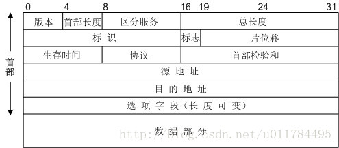
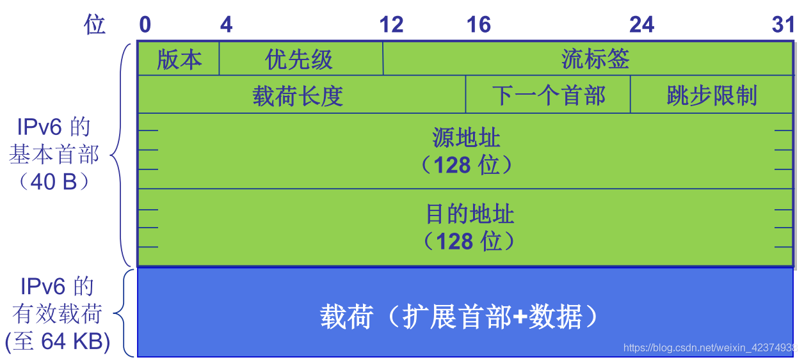

# 计算机网络

## 概述

### 分组交换与电路交换

#### 分组交换

+ **存储转发基础**:交换机在想输出链路传输某个分组的第一比特时，必须收到整个分组
+ **排队时延与分组丢失**：分组交换机有输出缓存，当到达的分组要输出时，链路正在输出其他分组，那么分组就要在输出缓存中等待，等待时长就是排队时延，当缓存充满，某些分组可能会被丢弃，称为分组丢失
+ **转发表与路由选择协议**：每台路由器都有一个转发表，用于把分组的目标地址映射为输出链路。分组到达路由器时，路由器检查目的地址与转发表。
+ **时延**:
  + 处理时延(processing delay):路由器检查分组的首部和目的地所用的时间
  + 排队时延(queuing delay):分组在交换机上等待被传输所用的时间
  + 传输时延(transmission delay):交换机把分组推向链路所用的时间（可以理解为“发射”所用的时间），分组长度为L，传输速率为R，则传输时延为L/R
  + 传播时延(propagation delay):分组从链路起点到链路终点所用的时间，取决于链路的物理性质
  + 端到端时延：N*(处理时延+排队时延+传输时延+传播时延)  N为链路数量

#### 电路交换

+ 端到端系统中的每两台终端之间都会有直接的链接
+ 网络复用
  + 频分复用(FDM):把频率分为不同频段供不同链接使用
  + 时分复用(TDM):把时间划为帧，供不同频段使用

### 协议层次

1. 应用层

   应用层的协议有HTTP、SMTP、FTP等

   应用层的信息分组称为**报文**(message)

2. 运输层

   运输层的协议有TCP和UDP

   运输层的信息分组称为**报文段**(segment)

3. 网络层

   网络层的协议有IP

   网络层的信息分组称为**数据报**(datagram)

4. 链路层

   链路层的例子有以太网、Wi-Fi和电缆接入等

   链路的信息分组称为**帧**(frame)

5. 物理层

## 应用层

### 应用层协议原理

#### 常见体系

+ 客户-服务器结构：常见于Web和电子邮件等，一台主机作为服务器，服务来自于客户的主机请求，客户间通信需要通过服务器，需要配置强大的服务器和数据中心
+ P2P体系结构：主机间直接通信，常见于P2P下载等

#### 运输层协议提供的服务

+ 可靠数据传输
+ 吞吐量
+ 定时
+ 安全性

#### 因特网提供的运输层协议

+ TCP
+ UDP

### Web与HTTP

HTTP采用TCP作为支撑的运输层协议

#### 持续连接与非持续连接

+ 持续连接：所有的请求与相应都使用同一个TCP发送

+ 非持续链接：每个请求与相应均使用一个单独的TCP发送

#### HTTP报文格式

+ 请求报文

  

  + 请求行：包含了请求方法(如GET、POST等)、URL字段与协议版本
  + 首部行：包含了一系列的字段名和对应的值，如Host与User-agent等
  + 实体体：包含了请求的数据，常在使用POST方法时用到

+ 响应报文

  

  + 状态行：包含了HTTP，协议版本与状态字段和相应的状态 
  + 首部行：包含了一系列的字段名与对应的值，如Connection、Date、Server等
    + Connection
    + Date
    + Serve
    + Last-Modified
    + Content-Type

#### Cookie

常用的cookie包含以下四个部分

+ HTTP请求报文中的字段
+ HTTP响应报文中的字段
+ 用户本地的cookie文件
+ 位于Web服务器的cookie数据库

#### Web Cache

Web Cache也叫代理服务器，用来存储用户最近请求过的对象的副本

流程：

+ 浏览器创建一个到Web缓存的TCP链接，香气中的对象发送一个HTTP请求
+ Web缓存检查是否保存了用户请求对象的副本，如果有则发送HTTP响应报文返回对象
+ 如果没有，则Web缓存器建立一个到初始服务器的TCP链接，并向其发送一个HTTP请求，初始服务器向Web缓存器发送包含该对象的HTTP响应
+ Web缓存既向用户通过HTTP响应报文发送该对象，又在cache保存一份该对象的副本

条件GET方法：

为了避免用户在Web Cache访问到的对象是陈旧的，用户可以在HTTP请求中使用条件GET，应用If-Modified-Since字段来请求自某事件以后的最新版本的对象

### 电子邮件

互联网电子邮件主要有以下三个组成部分：

+ 用户代理
+ 邮件服务器
+ 简单邮件传输协议(SMTP,Simple Mail Transfer Protocol)

#### SMTP操作：

+ 某用户的用户代理把邮件 发给其邮件服务器
+ 运行在邮件服务器的SMTP客户端发现了邮件，于是创建一个到目标用户邮件服务器的TCP连接
+ 经过SMTP握手，SMTP客户端通过该TCP链接发送邮件
+ 目标用户的邮件服务器收到邮件，用户可通过用户代理来阅读邮件

#### 与HTTP的对比

+ HTTP属于拉协议，而SMTP属于推协议
+ SMTP要求邮件以7比特ASCII编码，非7比特ASCII内容如图像也要按照此规则编码，HTTP无要求
+ 对于一个既含文本也含图形的文档，HTTP把每个对象都封装到HTTP响应报文中，而SMTP把这些放在一个报文中

#### 邮件报文格式

+ 首部行：包含FROM字段、TO字段与其他字段
+ 内容体：邮件内容

#### 邮件访问协议

+ POP3(第三版邮局协议 , Post Office Protocol Version 3）
+ IMAP(因特网邮件访问协议 , Internet Mail Access Protocol)
+ HTTP

### DNS(Domain Name System)

运行于UDP协议上，使用53号端口 

提供的服务

+ 主机名到IP地址的转换
+ 主机别名
+ 邮件服务器别名
+ 负载分配

#### DNS工作机制

+ 分布式DNS服务器
  + 根DNS服务器
  + 顶级域DNS服务器（TLD DNS）(例如com、cn、gov等)
  + 权威DNS服务器
  + 本地DNS服务器
+ 工作机制
  + 当用户主机请求一个域名的IP地址时，首先向本地DNS服务器发送请求，当本地DNS服务器没有记录时，转向上一级DNS服务器如根DNS服务器或者TLD DNS服务器，这些服务器会转向相关机构的权威DNS服务器，权威服务器返回准确的IP地址，本地DNS服务器保存记录

#### DNS记录与报文格式

+ DNS记录 格式为(Name,Value,Type,TTL)
  + Type=A,则Name为主机名，Value为对应的主机IP地址
  + Type=NS，则Name为域，Value为如何获得该域内主机的权威服务器的主机名
  + Type=CNAME，则Value是别名为Name主机的  的规范主机名
  + Type=MX，则Value是别名为Name的邮件服务器的规范主机名
  
+ DNS报文格式

  

  + 前六个字段(12字节)为首部区域
  + 查询问题区域包含了查询信息：主机名(Name)与类型(Type)
  + 回答问题区域则包含了对请求主机名的IP地址(Value)，可能会有多个

### **P2P**

#### 分发时间

文件大小为F，要获得文件的对等方数量为N，u为上传速率、d为下载速率

+ 客户-服务器结构

  传输时间为max{NF/us，F/min(d)}

+ P2P结构

  传输时间为max{F/us，F/min(d)，NF/(us+u1+u2+···+un)}

### 内容分发网(Content Distribution Network)

#### HTTP流与DASH

+ 视频只是HTTP服务其中一个普通的文件，但所有客户收到相同编码的视频
+ DASH(Dynamic Adaptive Streaming over HTTP,经HTTP的动态适应性流)，视频编码为不同的版本，客户可以动态的请求不同编码流的版本

#### CDN操作

1. 用户访问某视频流网站，并点击一个视频
2. 用户主机发送了一个DNS请求
3. 本地DNS服务器把请求发送至该网站的权威DNS服务器，该权威DNS服务器返回CDN方的主机名
4. DNS请求被发送至CDN方的DNS服务器，该DNS服务器返回用户请求视频的IP地址
5. 用户主机与视频的IP地址建立TCP连接

## 运输层

### 多路复用与多路分解

+ 多路分解(demultiplexing)：把运输层报文段中的数据交付到正确的套接字
+ 多路复用(multiplexing)：从不同套接字中收集数据，并为不同数据块加上首部信息生成报文段，并把报文段传递到网络层

### UDP

#### UDP的特点

+ 无连接的
+ 首部开销较小，只有8字节的首部
+ 常用UDP的应用有远程文件服务器(NFS)、DNS等

#### UDP报文段结构

校验和

三个16比特的字以二进制的形式相加，如果有溢出，就要回卷，最后把和取反，即为校验和

### 可靠数据传输(Reliable Data Transfer)

#### 可靠数据传输协议

##### RDT1.0

底层信道完全可靠，不会发送错误，也不会丢失分组

##### RDT2.0

引入ACK(Acknowledgment)与NAK(Negative Acknowledgment )

ACK表示接收方告诉发送方分组已经被正确接收

NCK表示接收方高速发送方分组错误

发送方收到ACK，则发送完成，若收到NAK，则重传分组，并等待接收方发送ACK或NAK

接收方收到没有受损的分组，则发送ACK，反之则发送NAK

##### RDT2.1

考虑到ACK与NAK可能会发生错误，发送方为每个分组添加序号，接收方丢弃重复的分组

​                                                                                                         发送方

​                                                                                                          接收方

##### RDT3.0

引入了倒计时，即发送方每一次发送分组时(不论是第一次发送还是重传)，都会启动一个倒计时，当超时时(不论是分组丢失，还是ACK/NAK丢失/超时)，发送方就会重新发送该分组

​                                                                                                  发送方

###### 几种可能出现的情况

+ 无丢包操作
+ 分组丢失
+ 丢失A CK
+ 过早超时

#### 流水线可靠数据传输协议

停等协议的利用率较低，所以采取以下措施

+ 增加序号范围
+ 发送方与接收方可以缓存分组

#### 回退N步(GBN)

协议有一个长度为N的窗口，窗口内的包都可以发送，每次发送一个包，都会开始倒计时

+ GBN中，接收方丢弃所有的失序分组，即若第n个包丢失，接受方未接受到第n个包，即使接收方接收到了第n+1个包，也只会返回ACK n-1，即告诉发送方只正确接收了前n-1个包

+ 当发送方接收到了ACK n，发送方就认为前n个包全部被正确接收

#### 选择重传(SR)

+ SR中，接收方不会丢弃失序分组，而是将其缓存起来，直到序号更小的丢失分组被接受到，不会失序，从而确认这些分组。若第n个分组丢失，接收方却接收到了第n+1个包，也会返回ACK n+1，但却把第n+1个包缓存起来，窗口也不会向前滑动，直到正确的接收到了第n个包，才会把第n和第n+1个包标记为接收
+ 当发送方未接受到ACK n，却接收到了ACK n+1，也不会认为第n个包被正确接受，而是在超时后重传这个包，收到ACK后窗口才向前滑动

### TCP

#### 概述

+ 面向连接的：在进程开始向另一进程发送消息前，必须发送某些预备报文段，确保数据传输。

  握手的流程

  + 客户发送一个特殊的TCP报文段，服务器用另一个特殊的TCP报文段来响应，客户再用第三个特殊TCP报文段响应
  + 前两个报文段没有有效载荷(应用层数据)，第三个报文段包含了有效载荷
  + 这种过程称为三次握手

+ 全双工(full-duplex)：应用层数据可从进程A到B，也可以从B到A

+ TCP链接引导数据到发送缓存(send buffer)中，TCP从发送缓存中取出并放入报文段的数据大小取决于最大报文段长度(Maximum Segment Size , MSS)，而MSS的大小则取决于最大链路层帧长度(Maximum Transmission Unit , MTU)。这种设置要保证单个链路层帧要包含一个TCP报文段加上TCP/IP首部长度(通常为40字节)

+ TCP为每块数据加上TCP首部，从而构成了TCP报文段

#### TCP报文段结构

+ 源端口号与目的端口号，用于多路复用与多路分解
+ 序号与确认号字段，用于可靠数据传输
+ 首部长度字段，由于选项字段的存在，TCP首部长度是可变的，但通常选项字段为空，TCP首部长度为20字节
+ 6bit的标志字段
  + ACK位表示确认号字段中的值是有效的
  + RST、SYN、FIN位用于连接的建立与拆除
  + PSH位置位表示接收方应立即把数据交给上层
  + URG位表示报文段里存在被发送端上层置为“紧急”的数据
+ 窗口大小：用于流量控制
+ 校验和字段：同UDP
+ 紧急指针字段：指出紧急数据的最后一位

#### 往返时间估计与超时

平均往返时间：EstimateRTT=(1-a) · EstimateRTT + a · SampleRTT                                                            a的推荐值为0.125

SampleRTT对EstimateRTT的偏离程度：DevRTT=(1-b) · DevRTT + b · |SampleRTT-EstimateRTT|       b的推荐值为0.25

超时间隔：TimeoutInterval=EstimateRTT + 4 · DevRTT                                                                             TimeoutInterval的推荐初始值为1s

#### 可靠数据传输

由于IP协议的不可靠性，TCP使用了可靠数据传输服务

流程如下

+ 从应用层接收到数据
+ 生成具有序号a的报文段
+ 向IP发送报文段并启动定时器，超时时长为TimeoutInterval
+ 如果定时器超时，则重传具有最小序号但未收到ACK的报文段，并重启定时器
+ 如果收到ACK(包含了有效ACK的报文段)，把ACK序号与最小序号且未确认的报文段序号比较。由于TCP采用累计确认，表示比ACK序号小的所有报文段均被确认。如果当前有未被确认的报文段，则重启定时器。

#### 流量控制

发送方维护一个称作接收窗口(receive window ,rcwd)的变量，用来告诉发送方接收方还有多少可用空间

接收方定义以下两个变量：

+ LastByteRead：接收方的应用层进程从缓存中读出的数据的最后一个字节的编号
+ LastByteRcvd：从网络层到达并存入接收方的接收缓存的数据的最后一个字节的编号

则必须要满足LastByteRcvd-LastByteRead≤RcvBuffer

接收窗口rcwd=RcvBuffer-(LastByteRcvd-LastByteRead)

接收方方把当前rcwd的值(初始值为RcvBuffer)放入它发送给发送方的报文段的接收窗口字段中

发送方定义以下两个变量：

+ LastByteSent：发送方发送的数据的最后一个字节的编号
+ LastByteAcked：发送方收到ACK的数据的最后一个字节的编号

则必须要满足：LastByteSent-LastByteAcked≤rcwd

当接收方把rcwd=0的信息告诉发送方后，发送方任要发送只有一个字节的报文段，被接收方确认后，缓存开始清空，并在确认报文里返回一个非0的rcwd值

#### TCP连接管理

客户端状态

服务端状态

##### 连接建立(三次握手)

1. 客户端向服务端发送一个特殊的TCP报文段，不包含任何数据，但SYN位被置为1，客户端也会随机的选择一个初始序号(client_isn)，这个报文段称为TCP SYN报文段，被封装到IP数据报中发送
2. 服务端收到了IP数据报并且提取TCP SYN报文段，为该TCP连接分配相关缓存与变量。服务端返回一个特殊的TCP报文段，不包含任何数据，SYN位被置为1，确认号字段为client_isn+1，服务器选择初始序号(server_isn)，这个报文段被称为TCP ACK报文段，被封装到IP数据报中发送
3. 客户端收到TCP ACK报文段后，也为该TCP连接分配相关的缓存与变量。客户端向服务端发送包含应用层数据的TCP报文段，该报文段的序号为client_isn+1,确认号为server_isn+1

##### 连接关闭(四次挥手)

1. 客户端向服务端发送一个特殊的TCP报文段，不包含任何数据，FIN位被置为1，序号为之前已经传输过最后一个字节的编号加一(u),确认号为之前收到的最后一个字节的编号加一(v)，该报文段称为TCP连接释放报文段。客户端进入终止等待1(FIN_WAIT_1)状态

2. 服务端收到TCP连接释放报文段后，发送TCP 确认报文，ACK位置为1，序号为v，确认号为u+1。服务端进入关闭等待(CLOSE_WAIT)状态，表示客户端已经没有数据要发送了，但是服务端还有数据要发送(包括未确认的报文段)，客户端仍要接受

3. 客户端收到来自服务端的TCP 确认报文后进入终止等待2(FIN_WAIT_2)状态，等待服务端发出的TCP连接释放报文段。

   服务端发送TCP连接释放报文，FIN位与ACK位被置为1，序号为w(因为在发送TCP连接释放报文前，服务端可能还发送了一些数据)，确认号为u+1，对之前客户端的连接释放报文重复确认，服务端进入最后确认(LAST_ACK)状态

4. 客户端收到来自服务端的TCP连接释放报文后，发送确认报文，ACK位置为1，序号为u+1，确认号为w+1，客户端进入时间等待(TIME_WAIT)状态。服务端收到该确认报文后进入关闭状态，而客户端还要等待2MSL(最长报文段寿命)后关闭，资源被释放

#### TCP拥塞控制

发送方维护一个变量：拥塞窗口(congestion window，cwnd)，对发送方能向网络层发送的数据进行了限制。发送方中发送但未被确认的数据量不能超过rcwd和cwdn的最小值，即LastByteSent-LastByteAcked≤min{cwnd，cwnd}

##### TCP拥塞控制算法

1. 慢启动(Slow Start)

   cwnd的值以一个MSS开始，每当传输的报文段首次得到确认，cwnd就增加一个cwnd

   慢启动的三种结束方式

   + 由于超时而丢包，ssthresh(慢启动的阈值)被置为此时cwnd的一半，cwnd被重置为1个MSS，此时重新开始慢启动
   + cwnd达到或超过ssthresh，结束慢启动，进入拥塞避免模式
   + 收到三个冗余ACK，ssthresh被置为此时cwnd的一半，cwnd被重置为ssth+3个MSS，执行一次快速重传并转到快速恢复状态

2. 拥塞避免(Congestion Avoidance)

   每个RTT只会使cwnd增加1个MSS

   拥塞避免的两种结束方式

   + 由于超时而丢包，ssthresh被置为此时cwnd的一半，cwnd被重置为1个MSS，此时重新开始慢启动
   + 收到三个冗余ACK，ssthresh被置为此时cwnd的一半，cwnd被重置为ssth+3个MSS，执行一次快速重传并转到快速恢复状态

3. 快速重传(Fast Retransmit)

   当接收方收到了失序的分组，不会返回对失序分组的确认，而是返回冗余ACK(接收到的最后一个有序分组的确认)，并将确认号（期望收到的下一个报文段的序号）设置为有序的。

   当发送方收到了同样的三个冗余ACK，就不会等待计时器超时，而是直接重传，接收方收到快速重传的报文段后，返回对收到的最后一个有序分组的确认

4. 快速恢复(Fast Recovery)

   此时ssthresh为之前cwnd的一半，cwnd为这时的ssthresh+3

   当失序报文段的ACK到达时，进入拥塞避免状态

   当超时时，进入慢启动状态

## 网络层：数据平面

### 概述

#### 网络层实现的功能

+ 转发(forwarding)：分组到路由器的输入链路时，路由器要把该分组移动到适当的输出链路，是路由器的动作。在数据平面中实现
+ 路由选择(routing)：网络层决定分组由发送放到接收方采用的路由路径，决定算法为路由选择算法。在控制平面中实现

路由器中都有一个转发表(forwarding table)，路由器检查到达的分组的首部，在转发表中进行索引，得到具体的输出链路。转发表有两种配置方法，一种是由人工配置，使用路由选择算法；另一种是SDN(软件定义网络 Software-Defined Networking)方法，路由器仅执行转发，转发表由远程控制器生成并分发

### 路由器工作原理

+ 输入端口 
+ 交换结构
+ 输出端口
+ 路由选择处理器

#### 输入端口处理与基于目的地的转发

最长前缀匹配规则

#### 交换

+ 经内存交换
+ 经总线交换
+ 经互连网络交换

#### 分组调度

+ FCFS
+ 优先队列(priority queueing)
+ 循环排队(Round Robin Queueing)
+ 加权公平排队(Weighted Fair Queueing)

### IP协议

#### IPV4

##### IPV4数据报格式

字段

+ 版本：规定了IP协议的版本号
+ 首部长度：大多数为20字节
+ 区分服务(服务类型)：表明服务类型，如实时数据报、非实时流量等
+ 总长度：数据报的总长度
+ 标识、标志、片偏移：与IP分片有关
+ 寿命：TTL，每经路由器处理一次，TTL减一，若为零，则被抛弃
+ 协议：所使用的运输层协议
+ 首部检验和：首部中的每两个字节为一个数，进行检验和运算
+ 源地址与目标地址
+ 选项：很少使用
+ 数据：TCP/UDP报文段等

##### IP数据报分片

链路层帧呢个承载的最大数据量为最大传送单元(Maximum Transmission Unit,MTU),包含首部+数据

##### IPV4编址

每台主机和路由器上每个接口都有唯一的IP地址

子网掩码：a.b.c.d/x 前x位为子网掩码，子网内所有主机具有相同的前x位IP地址

网络地址：子网内网络地址第一位

广播地址：子网内网络地址最后一位

#### 动态主机配置协议(Dynamic Host Configuration Protocol，DHCP)

主机自动/被分配一个IP地址

过程：

+ DHCP服务器发现

  客户(新到达的主机)通过DHCP发现报文来发现与之交互的DHCP服务器。DHCP发现报文使用UDP，端口67，主机把这个报文封装在IP数据报中。

  但主机不知道DHCP服务器的IP地址，所以主机在IP数据报中使用0.0.0.0的源IP地址，使用广播地址为目标IP地址

+ DHCP服务器提供

  DHCP服务器收到DHCP发现报文时，用DHCP提供报文做出响应。该报文的目标IP地址为广播地址，数据包含推荐的IP地址、IP地址租用期。由于子网内可能存在多个DHCP服务器，每个接收到DHCP发现报文的服务器都会发出提供报文。

+ DHCP请求

  主机从到达的DHCP提供报文中选择一个，向其发送DHCP请求报文

+ DHCPACK

  DHCP服务器用DHCP ACK报文对请求报文响应

#### 网络地址转换(Network Address Translation)

路由器在外部网络被视为有单一IP地址的单一设备，当外部数据报到达路由器时，路由器查阅NAT转换表，更改目标IP地址与端口号，将其转发至子网内的对应主机。当子网内主机的数据报到达路由器时，路由器查阅NAT转换表，更改源IP地址与端口号，将其转发至对应的外部主机

#### IPV6

IPV6的地址长度为128bit，首部长度为40字节

##### IPV6数据报格式

字段：

+ 版本
+ 优先级：服务类型
+ 流标签：对某些数据报给出优先级
+ 载荷长度
+ 下一个首部：表明数据报中的内容要交付给哪个协议(上层协议)
+ 跳步限制：转发数据报的路由器对该字段减一，减为零时数据包被抛弃
+ 源地址与目标地址

### 通用转发与SDN

在通用转发中，每台交换机都有一张匹配加动作表，称之为流表(Flow Chart)

表项有

+ 首部字段值的集合
+ 计数器集合，包括匹配的分组的计数器、更新时间计数器等
+ 动作集合

实现的功能

+ 匹配
  + 包含了运输层、网络层、链路层的报文的字段值
+ 动作
  + 转发
  + 负载均衡分组
  + 丢弃
  + 重写首部值

## 网络层：控制平面

### 概述

+ 每路由器控制

  每个路由器都有一个路由选择组件，计算转发表。

  OSPF与BGP协议都是通过这种方法控制的

+ 逻辑集中式控制

  有逻辑集中式控制器计算并分发转发表，每台路由器通过控制代理(CA)与逻辑集中式控制器进行交互

### 路由选择算法

几种分类方式

+ 集中式路由选择算法

  全局式计算，计算输入所有节点间的连通性与所有链路的开销

  链路状态算法(Link State，LS)

+ 分散式路由选择算法

  分布式、迭代式计算，每个节点仅需要与其直接相连的链路的信息就可以计算

  距离向量(Distance-Vector，DV)算法

+ 静态路由选择算法

  通常由人工配置

+ 动态路由选择算法

  随着相应拓扑或链路开销大变化而变化

+ 负载敏感算法
+ 负载迟钝算法

#### 链路状态算法(LS)

相当于Dijsktra算法

#### 距离向量路由算法(DV)

Bellman-Ford方程：dx(y) = min{c(x,v)+dv(y)} 

##### 算法描述

对每个节点x
（1）在每个节点建立自己的距离向量表并初始化。
（2）在每个节点将自己维护的距离向量表向其邻居节点转发。
（3）每个节点收到邻居节点发送的距离向量表以后基于新的信息采用方程来更新自己的距离向量表。
（4）当自己的距离向量表发生变化时，将新的距离向量表发送给自己的邻居节点，如果与以前的向量表相同则不向其邻居节点转发，直到每个节点的距离向量表达到稳定为止。

假设图中只有3个节点，3个节点两两相连，因此可在每个节点建立自己的距离向量表。

上图为x节点的选路表。
节点x选路表中：
行：该节点的距离向量Dx和其邻居的距离向量Dv；
列：所有目的节点。
在初始化时由于每个节点只知道本路由器相连的链路费用，因此只有到相邻节点的最低路径费用有值，为对应的链路费用值。如下图

当每个节点完成自己的距离向量表后，会不断的向自己的邻居节点发送这个距离向量表。
每个节点收到邻居新的距离向量表后，会使用B-F公式更新自己的距离向量。若距离向量发生变化将新的距离向量通知给邻居。
当距离向量不在变化，则算法终止。

·  

x、y、z三个节点向其邻居发送了自己的向量表之后，x节点收到了来自y节点和z节点的距离向量分别是201和710。分别将这两个向量放在第二行和第三行的第一列中。然后利用收到的新的信息来更新自己的距离向量。首先更新x节点到y节点的最低路径费用。根据B-F方程可是x节点到y节点最低路径费用为2，因此保持不变二x节点到z节点的最低路径费用可进一步减小为3即x节点先到y节点再到z节点。经过上述修改后x的向量表如第一行第二列所示。x节点新的距离向量与以前的发生了变化，因此x节点会将新的距离向量向其邻居节点y和z发送。依次类推，每个节点都不断更新自己的距离向量，直到不在发送变化为止。例如第二行第二列这里的y节点重新计算距离向量后发现这里的距离向量没有发生变化仍然是201，因此不再向其邻居节点发送。
我们观察到多次从邻居接受更新距离向量、重新计算选路表项、并向邻居发送更新通知的过程，一直持续到没有更新报文发出为止；算法进入静止状态，直到某个链路费用发生改变为止。

##### 链路改变与链路故障

当一个节点检测到从它到邻居的链路费用发生变化时，就更新其距离变量，如果最低费用路径的费用发生变化，通知其邻居。
（1）某条链路费用减少时

如图所示，当y到x的链路费用从4变为1的情况。
t0时刻：y检测到x的链路费用从4变为1，更新其距离变量，并通知其邻居z。
t1时刻：在t1时刻，z收到来自y的更新报文，并更新自己的距离表，此时到节点x的最低费用减为2，并通知其邻居y。
t2时刻：在t2时刻y收到来自z的更新报文，并更新自己的距离表，此时到节点x的最低费用不变仍为1，不发送更新报文，算法静止。
因此当x与y之间费用减少，算法只需两次迭代到达静止状态。
（2）某链路费用增加时

如图所示，假设x与y之间的链路费用从4增加到60。
链路费用变化前：
Dy（x）=4，Dy（z）=1，Dz（y）=1，Dz（x）=5
t0时刻：在t0时刻，y检测到链路费用从4变为60。更新到x的最低路径费用
dy  (x)=min{dx (x)+c(y,x)，dz (x)+c(y,z)}=min{0+60,1+5}=6
经节点z到x费用最低，此新费用错误，发给节点z。
t1时刻；t1时刻z收到新费用，更新其到x的最低路径费用
dz 

 (x)=min{dx (x)+c(y,z)，dy  (x)+c(z,y)}=min{0+50,1+6}=7
经节点y到x费用最低，发给节点y。
t2时刻：y收到新费用，更新到x的最低路径费用
dy(x)=min{dx (x)+c(y,x)，dz (x)+c(y,z)}=min{0+60,1+7}=8
经节点z到x费用最低，发给节点z。
以此节点y或节点z的最低费用不断更新。
这里就产生了选路循环：为到达x，y通过z选路，z又通过y选路。即目的地为x的分组到达y或z后，将在这两个节点之间不停地来回反复，直到转发表发送改变为止。
上述循环将持续44次迭代，直到z最终算出它经由y地路径费用大于50为止。并确定z到x地最低费用路径是zx，y到x地最低费用路径是yzx。
通过上述两个变化我们可知链路费用减少地好消息传播的快，而链路费用增加的坏消息传播很慢。甚至当链路费用增加很大时会出现“计数到无穷”问题。

##### 链路状态路由算法和向量路由算法对比

1. 消息复杂度

   链路状态路由算法（LS）：需要知道每条链路的费用，需发送O（nE）个报文；当一条链路的费用发生变化时，必须通知所有节点。

   距离向量路由算法（DV）：迭代时，仅在两个直接相连邻居之间交换报文；当链路费用改变时，只有该链路相连的节点的最低费用路径发生改变时，才传播已经、改变的链路费用。

2. 收敛速度

   LS：需要O（nE）个报文和O（n^2 ）的搜寻。

   DV：收敛较慢。可能会遇到选路回环，或计数到无穷的问题。

3. 健壮性：当一台路由器发生故障、操作错误或受到破坏时

   LS：路由器向其连接的一条链路广播不正确费用，路由计算基本独立（仅计算自己的转发表），有一定健壮性。

   DV：一个节点可向任意或所有目的节点发布其不正确的最低费用路径，一个节点的计算值会传递给它的邻居，并间接地传递给邻居的邻居。

### OSPF

OSPF是自治系统(Autonomous System)内部的路由选择协议

OSPF是一种基于链路状态的路由协议（LS）

### BGP(Broder Gateway Protocol,边界网关协议)

BGP是自治系统间的路由选择协议

### SDN(软件定义网络 Software-Defined Networking)

### ICMP(因特网控制报文协议)

### 网络管理与SNMP

## 链路层

### 概述

运行链路层协议的设备为节点(node)，包括主机、路由器、交换机等

节点间的通信信道称为链路(link)

链路层提供的服务

+ 成帧(framing)

  网络层数据报在被传输前，都要被链路层协议封装成帧

+ 链路接入

  媒体访问控制(MAC，Media Access Control)协议规定了帧在链路上传输的规则

+ 可靠交付

  与运输层的可靠传输服务类似，链路层也有可靠交付服务，但是常用于易产生高差错率的链路，如无线链路

+ 差错检测和纠正

  帧中的一个比特在被传输时，可能会被反转。

  与传输层和网络层的因特网校验和不同，链路层的差错检测和纠正更复杂，且常用硬件实现

链路层在主机上在网络适配器(Network Adapter)中实现，网络适配器上集成了链路层的许多功能

### 差错检验和纠正技术

#### 奇偶校验

+ 使用单个奇偶校验位，使得校验码中1的个数始终为偶数，但是未检测出错误的概率为50%
+ 二位奇偶校验。可以检测并纠正出单个比特的错误

#### 检验和方法

求和并取反码

#### 循环冗余检测(Cyclic Redundancy Check，CRC)

发送方与接收方协商一个生成多项式G，通常长度为r+1

对于一段长度为d要发送的数据D，要有一段长为r的CRC比特R

接收方检测d+r长度的比特字段能否被G整除，如果结果为零，则证明没有出错

R的计算过程：D左移r位，直接除以(按位异或)G，得到商的后r位则为R

在本例中D为101001，G为1101，得到商为1，则R为001

接收方用101001001除以1101，结果为0，证明没有出错 

### 多路访问链路和协议

广播链路(broadcast link)，多个发送方与接收节点都在相同的、单一的、共享的广播信道上

##### 信道划分协议(Channel Partitioning Protocol)

+ TDM(时分多路复用)

+ FDM(频分多路复用)

+ CDMA(码分多址，Code Division Multiple Access)

  为每个节点分配一种不同的编码，节点用这种编码对其发送的数据进行编码

##### 随机接入协议(Random Access Protocol)

##### 轮流协议(Taking-turns Protocol)

### 交换局域网

#### 链路层寻址与ARP

链路层地址称为LAN地址、物理地址、MAC地址等，一般长度为6字节

地址解析协议(Address Resolution Protocol)，用于在子网内把IP地址解析为MAC地址

#### 以太网

以太网帧结构

+ 前同步码

  8个字节

+ 目的地址、源地址

  6个字节，是MAC地址

+ 类型

+ 数据

  包含IP数据报

+ CRC

  循环冗余检测，4个字节

#### 链路层交换机

+ 过滤(filtering)

  决定一个帧是被转发到某个接口还是被丢弃

+ 转发(forwarding)

  决定一个帧被转发到哪个接口

##### 交换机表

+ MAC地址

+ 接口

  通向该MAC地址的交换机接口

+ 时间

  该表项在交换机表中建立的时间

##### 交换机自学习

1. 交换机表初始为空
2. 对于在每个接口到达的帧，交换机表存储一项表项
   1. 源MAC地址
   2. 接口
   3. 时间
3. 在一段时间后，若没有接收到以该地址为源地址的帧，就删除该表项

##### 路由器、交换机和集线器

| 区别                   | 集线器                                         | 交换机                                                       | 路由器                                   |
| :--------------------- | :--------------------------------------------- | :----------------------------------------------------------- | :--------------------------------------- |
| 工作层次               | 物理层                                         | 数据链路层                                                   | 网络层                                   |
| 作用                   | 信号放大和传输作用，可将计算机网络连接在一起。 | 将一个网络端口分成多个网络端口，用于连接更多的设备；同时可管理端口和配置VLAN安全管理。 | 连接不同的网络，以及选择信息传输的线路。 |
| 数据传输形式           | 电信号                                         | 链路层帧                                                     | 网络层数据报                             |
| 用于数据传输的地址类型 | MAC地址                                        | MAC地址                                                      | IP地址                                   |
| 即插即用               | 是                                             | 是                                                           | 否                                       |
| 流量隔离               | 无                                             | 有                                                           | 有                                       |
| 优化路由               | 无                                             | 有                                                           | 无                                       |

### 链路虚拟化：网络作为链路层

